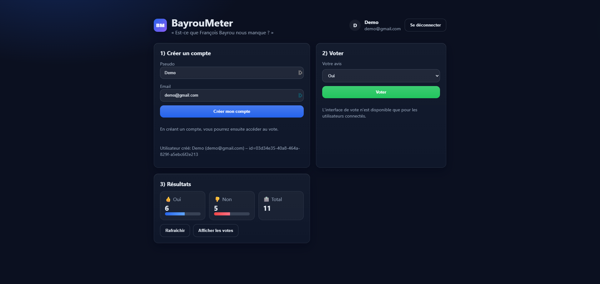
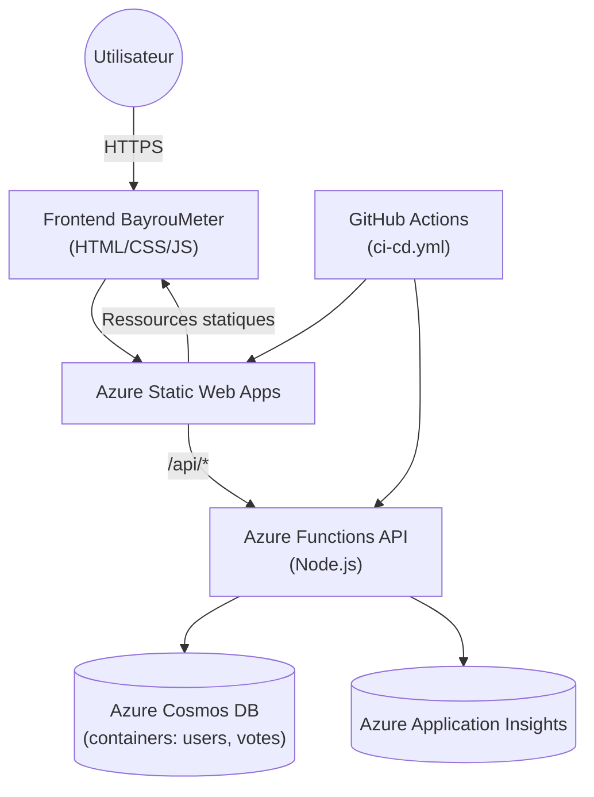
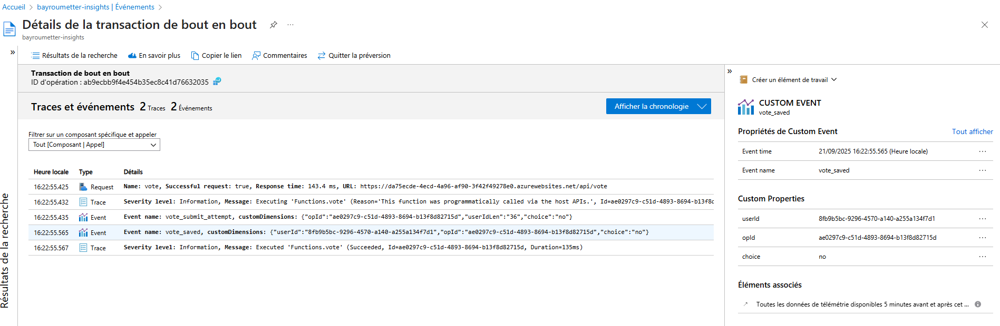
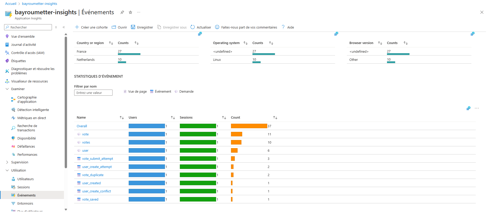

# BayrouMeter - Documentation
**Capture d'écran du site :**



Lien du site : https://icy-sky-0b8794103.2.azurestaticapps.net/

## Architecture de l'application


L'application est composee d'un frontend statique (HTML/CSS/JS) servi par Azure Static Web Apps et d'une API Azure Functions exposee sous `/api`. L'API s'appuie sur deux conteneurs Cosmos DB (`users` et `votes`) et publie sa telemetrie vers Azure Application Insights. Les tests et deploiements sont orchestries par un workflow GitHub Actions (`.github/workflows/ci-cd.yml`) qui execute les tests Jest avant de publier le frontend et l'API.

### Composants
- **Frontend** : page unique dans `frontend/index.html`, gere l'authentification legere (pseudo/email) et la soumission des votes via fetch sur l'API.
- **API** : trois fonctions HTTP anonymes (`user`, `vote`, `votes`) developpees en Node.js. Les fonctions partagent des helpers Cosmos DB et Application Insights dans `api/shared`.
- **Base de donnees** : Azure Cosmos DB (API SQL). Deux conteneurs : `users` pour les comptes et `votes` pour les votes (cle primaire = `id`).
- **Observabilite** : Application Insights (optionnel en local). Les evenements/metrics sont traces via `api/shared/telemetry.js`.
- **CI/CD** : pipeline GitHub Actions qui teste (`npm test` dans `api`) puis deploie automatiquement sur Azure Static Web Apps.

## API REST disponible
| Methode | Route       | Description | Corps requis | Reponses cles |
|---------|-------------|-------------|--------------|---------------|
| `POST`  | `/api/user` | Cree un utilisateur (pseudo + email) et retourne son identifiant. | `{ "pseudo": "string", "email": "string" }` | `201` -> objet utilisateur, `400` si champs manquants, `409` si email deja enregistre, `500` pour erreur interne. |
| `POST`  | `/api/vote` | Enregistre un vote (`yes`/`no`) pour un utilisateur existant. | `{ "userId": "uuid", "choice": "yes|no" }` | `201` -> confirmation, `400` si payload invalide, `409` si l'utilisateur a deja vote, `500` pour erreur interne. |
| `GET`   | `/api/votes`| Retourne la liste des votes et des statistiques agregees. | N/A | `200` -> `{ items: [...], stats: { yes, no, total } }`, `500` pour erreur interne. |

Toutes les fonctions sont declarees sous `api/<fonction>/function.json` avec un declencheur HTTP anonyme, compatibles avec Azure Static Web Apps.

## Variables d'environnement
Configurer les clefs suivantes pour l'API (via `local.settings.json` en local ou variables d'application Azure) :
- `COSMOS_CONN_STRING` *(obligatoire)* : chaine de connexion complete Azure Cosmos DB.
- `DB_NAME` *(optionnel, defaut `bayroumeter`)* : base utilisee dans Cosmos.
- `USERS_CONTAINER` *(optionnel, defaut `users`)* : conteneur pour les utilisateurs.
- `VOTES_CONTAINER` *(optionnel, defaut `votes`)* : conteneur pour les votes.
- `APPINSIGHTS_CONNECTION_STRING` *(optionnel)* : chaine Application Insights pour activer la telemetrie.
- `NODE_ENV` *(optionnel)* : environnement reporte dans les traces.

Azure Functions requiert aussi `AzureWebJobsStorage` (Storage Account ou Azurite) pour s'executer localement.

## Execution et tests en local
### Prerequis
- Node.js 18+
- Azure Functions Core Tools (v4) pour lancer les fonctions localement (`npm i -g azure-functions-core-tools@4`)
- Azurite ou un compte de stockage Azure pour `AzureWebJobsStorage`
- Un compte/emulateur Cosmos DB (API SQL)

### Initialiser Cosmos DB
1. Creer une base `bayroumeter` (ou ajuster `DB_NAME`).
2. Creer deux conteneurs partitionnes sur `/id` : `users` et `votes`.

### Demarrage de l'API (Azure Functions)
```bash
cd api
npm install
# Creer local.settings.json si absent
cat > local.settings.json <<'EOF'
{
  "IsEncrypted": false,
  "Values": {
    "FUNCTIONS_WORKER_RUNTIME": "node",
    "AzureWebJobsStorage": "UseDevelopmentStorage=true",
    "COSMOS_CONN_STRING": "AccountEndpoint=...;AccountKey=...;",
    "DB_NAME": "bayroumeter",
    "USERS_CONTAINER": "users",
    "VOTES_CONTAINER": "votes",
    "APPINSIGHTS_CONNECTION_STRING": ""
  }
}
EOF
func start
```
> `UseDevelopmentStorage=true` suppose qu'Azurite tourne en local (`azurite --silent`). Remplacer par une chaine de stockage Azure sinon.

### Lancer le frontend
- Option rapide : ouvrir `frontend/index.html` dans un navigateur.
- Option recommandee (pour eviter les blocages CORS) :
  ```bash
  npm install -g @azure/static-web-apps-cli
  swa start frontend --api-location api
  ```
  Le CLI Static Web Apps gere le proxy entre le frontend et l'API locale.

### Tests unitaires
```bash
cd api
npm test
```
Les tests Jest couvrent les trois fonctions HTTP et se trouvent dans `api/__tests__`.

## Integration et deploiement continus
Le workflow `.github/workflows/ci-cd.yml` :
- Installe les dependances de l'API et execute `npm test`.
- Si les tests reussissent : deploie frontend + API sur Azure Static Web Apps (`Azure/static-web-apps-deploy@v1`).
- Sur fermeture de PR : nettoie l'environnement de previsualisation.

Pour declencher un deploiement manuel, utiliser l'action **Run workflow** via GitHub.

# Monitoring & Observabilité (API uniquement)

> Cette section détaille **tous les KPIs instrumentés côté API** 
---

## Prérequis

* La télémétrie est active si la variable d’environnement **`APPINSIGHTS_CONNECTION_STRING`** est définie sur l’API (Azure Functions).
* L’initialisation se fait via `api/shared/telemetry.js`, qui configure l’auto-collect (`requests`, `dependencies`, `exceptions`, `traces`) et expose un client pour les **KPIs custom** (`trackEvent`, `trackMetric`).

---

## Catalogue des KPIs

### A. Événements (customEvents)

Événements émis via `trackEvent`. Utiles pour compter, filtrer par dimensions (ex: `choice`, `emailDomain`) et construire des funnels.

| Nom                             | Déclenchement                             | Propriétés clés                           | Intérêt produit/ops                                                                    |
| ------------------------------- | ----------------------------------------- | ----------------------------------------- | -------------------------------------------------------------------------------------- |
| `user_create_attempt`           | à la réception d’une requête `POST /user` | `opId`, `pseudoLen`, `emailDomain`        | Volume d’intentions d’inscription, détection d’abandons et profils par domaine d’email |
| `user_create_validation_failed` | si champs manquants                       | `opId`, `reason`, `hasPseudo`, `hasEmail` | Qualité des payloads; aide à prioriser l’UX/formulaires                                |
| `user_create_conflict`          | email déjà existant                       | `opId`, `emailDomain`                     | Taux de collision, suspicion de spam/tests, besoin de messages clairs                  |
| `user_created`                  | inscription réussie                       | `opId`, `userId`, `emailDomain`           | **KPI principal d’acquisition** (nouveaux comptes)                                     |
| `vote_submit_attempt`           | à la réception d’un `POST /vote`          | `opId`, `userIdLen`, `choice`             | Volume d’intentions de vote; entrée du funnel vote                                     |
| `vote_submit_validation_failed` | payload invalide                          | `opId`, `hasUserId`, `choice`             | Qualité des intégrations clientes; erreurs UX                                          |
| `vote_duplicate`                | l’utilisateur a déjà voté                 | `opId`, `userId`                          | **KPI d’intégrité**; surveiller la proportion de doubles tentatives                    |
| `vote_saved`                    | vote persistant                           | `opId`, `userId`, `choice`                | **KPI principal d’engagement**; répartition des choix, conversion                      |

> **Dimensionnement** : toutes les propriétés sont consultables sous `customDimensions.<clé>` dans KQL (ex: `customDimensions.choice`).

### B. Métriques (customMetrics)

Métriques numériques émises via `trackMetric`. Idéales pour latences, comptages, pourcentiles.

| Nom                        | Mesure                                                       | Unité | Intérêt SRE/Perf                                  |
| -------------------------- | ------------------------------------------------------------ | ----- | ------------------------------------------------- |
| `cosmos_user_query_ms`     | temps de requête Cosmos pour vérifier l’existence d’un email | ms    | Santé/latence de la lecture Cosmos `users`        |
| `cosmos_user_insert_ms`    | temps d’insertion d’un utilisateur                           | ms    | Débit/latence d’écriture `users`                  |
| `user_create_duration_ms`  | durée totale du handler `POST /user`                         | ms    | **SLO** de création compte (p50/p95)              |
| `cosmos_vote_check_ms`     | temps de lecture vote par `userId`                           | ms    | Santé/latence de la lecture `votes`               |
| `cosmos_vote_insert_ms`    | temps d’écriture du vote                                     | ms    | Débit/latence d’écriture `votes`                  |
| `vote_handler_duration_ms` | durée totale du handler `POST /vote`                         | ms    | **SLO** de vote (p50/p95), corrélé à l’expérience |

### C. Auto-collect (tables standard)

* `requests` : temps de réponse HTTP par endpoint (`/api/user`, `/api/vote`), codes 2xx/4xx/5xx.
* `dependencies` : appels Cosmos DB (hôtes, latences, échecs).
* `exceptions` : erreurs non gérées et `trackException`.
* `traces` : logs applicatifs.

---

## Consommation des données

* Les événements custom résident dans la table `customEvents` et les métriques dans `customMetrics` du workspace associé à Application Insights.
* Exécutez les requêtes KQL ci‑dessous sur ce workspace pour l’analyse, l’automatisation (exports, jobs) ou via l’API **Azure Monitor Logs** / SDK.
* Pour les latences, suivez au minimum `p50` et `p95` et corrélez avec `requests`/`dependencies`.

---

## Tableaux de bord & Alertes (recommandations)

* **SLOs** : viser p95 < **500 ms** sur `vote_handler_duration_ms` et `user_create_duration_ms`.
* **Alertes basées Logs** (KQL) : déclarez une requête retournant un seuil et déclenchez quand il est dépassé.

  * Exceptions :

    ```kusto
    exceptions | summarize Err=count() by bin(timestamp, 5m) | where Err > 0
    ```
  * Lenteur vote : p95 `vote_handler_duration_ms` > 500 ms sur une fenêtre de 15 min.
  * Duplications : `vote_duplicate` > 5 par 5 min **ou** taux `DupRate` > 5%.
* **Tableaux de bord** : composez des visuels (graphiques, tableaux) à partir des requêtes KQL fournies (outil de visualisation au choix).

---

## Exemples (captures réelles)

**Événement `vote_saved` avec propriétés :**



**Vue « Événements » (volumétrie et liste des événements custom) :**



